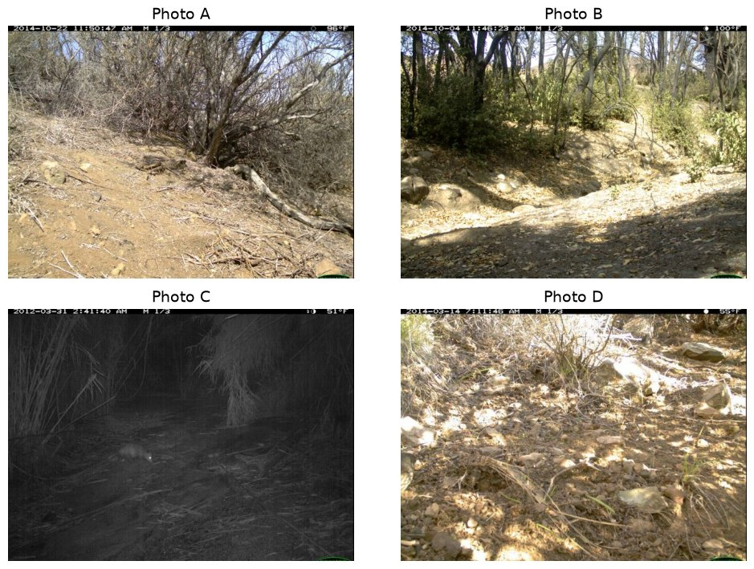
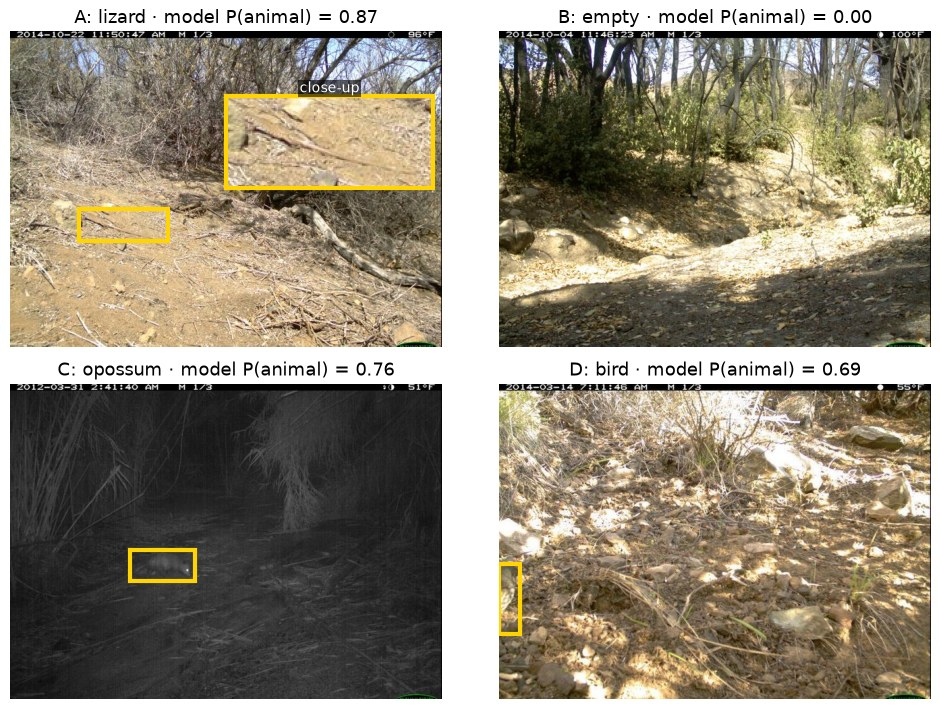

## Use statistics for AI and AI for statistics

That is this course in one line. Each half is a question.

- **Statistics for AI.** Someone says an AI system works. How would we know?
- **AI for statistics.** An AI tool did part of our analysis. How do we know it is right?

**What do you think?**

::: notes
Take three or four answers and write them on the next slide. Do not resolve it yet. The opening comes back to this after the sepsis example.
:::

---

::: notes
Blank slide for writing the class's answers. Press C to draw on this slide, or B for a blackboard. Press the same key again to return.
:::

## How do you use AI for data work? {.smaller}

Raise your hand if you have used an AI tool to

- write or fix code in Python, R, or SQL;
- clean or reshape a dataset;
- pick a statistical method or model;
- explain output you did not understand;
- write up results;
- do homework you were supposed to do yourself (no hands needed).

::: notes
After the hands, tell a story of AI being confidently wrong. Mine: I was sure there was a bug in my code. The AI told me over and over that it had checked the code itself and it was correct. There was a bug.

Then ask for theirs. Typical ones: it invented a function or argument, fit the wrong model, misread a coefficient, or made up a citation. These set up the next slide.
:::

## Good use or bad use? {.smaller}

Name a way to use AI for data work. Is it a good use, a bad use, or does it depend?

::: notes
Let the class generate the examples and write them on this slide (press C to draw). For each one, take a quick vote: good, bad, or it depends. Where the room splits, ask what would make it a good use.

If the room is quiet, offer some of these:

1. Ask an AI to fix a pandas error message.
2. Paste in a dataset and ask, "What's significant?"
3. Ask it to explain what a logistic regression coefficient means.
4. Ask it to write the conclusion of your analysis.
5. Use it to label 10,000 images for training data.
6. Ask it to write tests that check your data-cleaning code.
7. Ask which model to use, then use that model.
8. Ask it to summarize a paper you have not read, then cite the paper.

Where these usually land: 1 and 6 are good because you can check them (the code runs, the tests pass). 3 is good if you check it against a source. 2 and 7 hand over the judgment. 4 depends on whether you could defend every sentence. 5 depends on checking a sample of the labels, which is Week 2. 8 is bad.
:::

## What the good uses have in common {.smaller}

::: {.fragment}
- You can **check** the output. The code runs, the test passes, or you know what a right answer looks like.
- A mistake is **cheap to catch** before it matters.
- **You** still make the calls that need judgment: which question, which data, and what the result means.
:::

::: {.fragment}
The bad uses hand over the judgment and leave no way to check.

That is the **AI for statistics** half of this course. Use AI where you can check it, and learn how to check it.
:::

## A claim to check: a sepsis alarm {.smaller}

Sepsis is the body's extreme response to an infection. At least 1 in 5 adults who develop it die in the hospital or are discharged to hospice. Finding and treating it early is linked to lower mortality.

Epic, a major medical-records company, sells a model that scores each hospital patient's risk of sepsis and alerts the staff. Hundreds of US hospitals use it. Epic and a partner health system reported an **AUC between 0.76 and 0.83**.

Your hospital is deciding whether to turn the alerts on. **What would you want to know first?**

<p class="compact-note">AUC is the chance the model gives a random patient with sepsis a higher score than a random patient without it. 0.5 is a coin flip, and 1 is perfect.<br>
Sources: CDC, "About Sepsis" (cdc.gov/sepsis); Wong et al. (2021), JAMA Internal Medicine 181(8):1065–1070; Habib, Lin, and Grant (2021), JAMA Internal Medicine 181(8):1040–1041.</p>

::: notes
Collect answers on the board (press C to write) and keep them; they become the five stages two slides from now. Steer toward: whose patients it was built and tested on; how sepsis was defined in the records; when each score was made relative to sepsis; how many real cases it catches; how often it alarms; how precise the numbers are; whether it beats what doctors and nurses already catch.

Source details. CDC: "Sepsis is the body's extreme response to an infection"; "At least 1 in 5 adults and 1 in 10 children who develop sepsis die during hospitalization or are discharged to hospice." For scale if asked: about 1.7 million US adults develop sepsis each year and at least 350,000 of them die or go to hospice, roughly 0.1% of Americans and about 1 in 9 US deaths. These are deaths among people who had sepsis, many of whom were already very sick, so they are not all deaths caused by sepsis. Wong et al.: the model "is implemented at hundreds of US hospitals"; early detection and treatment "have been associated with a significant mortality benefit." The 0.76 to 0.83 AUC was "jointly reported by Epic and University of Colorado Health" (Habib, Lin, and Grant editorial).
:::

## What an independent check found {.smaller}

Michigan Medicine ran the model on 38,455 hospitalizations, and 7% had sepsis. Counting only scores made **before** sepsis began,

- the AUC was **0.63** (95% CI 0.62 to 0.64);
- it **missed two-thirds** of the patients who had sepsis;
- it alerted on **18% of all patients**, and only about 1 alert in 8 was sepsis.

::: {.fragment}
Counting scores from up to 3 hours **after** sepsis began raised the AUC to **0.80**. An alarm that fires once sepsis is obvious looks accurate and helps no one.

The model is a penalized **logistic regression**, the model we start with today.
:::

<p class="compact-note">Wong et al. (2021), "External validation of a widely implemented proprietary sepsis prediction model in hospitalized patients," JAMA Internal Medicine 181(8):1065–1070 (corrected version).</p>

::: notes
Point out the alert numbers: staff who get an alert on 18% of patients, mostly false, learn to ignore it. That is a decision cost, not just a metric.

The 95% interval is narrow because the sample is large. The problem is not sampling uncertainty. It is which patients, how sepsis was defined, and when a prediction counts. The authors write that "the large difference in reported AUCs is likely due to our consideration of sepsis timing." Counting predictions made after the outcome is already apparent is a form of leakage, which is Week 3.

Source details from the corrected article: sensitivity 33%, specificity 83%, positive predictive value 12% at a score threshold of 6; 1,709 of 2,552 sepsis patients not identified (67%); alerts for 6,971 of 38,455 hospitalizations (18%). Measured over 4- to 24-hour prediction windows, the AUC was 0.72 to 0.76. The model was developed on about 405,000 encounters from 3 health systems, 2013 to 2015.
:::

## The two halves are one skill {.smaller}

Both halves ask the same question: **how do you know it is right?**

| | Statistics for AI | AI for statistics |
|---|---|---|
| What we check | a claim about an AI system | work an AI tool did for us |
| Example | "AUC between 0.76 and 0.83" | AI-written code that cleans our data |
| What we ask | Which population? Measured how? How precise? | Does it run? Is it right? Can I explain it? |

The course has two goals that match. You will learn to evaluate claims about AI systems, and to use AI tools well without handing over your statistical judgment.

## Every analysis has five stages {.smaller}

| Stage | The sepsis alarm |
|---|---|
| 1. Define the question, hypotheses, and estimands | Will the alarm catch sepsis earlier for our patients? |
| 2. Explore the data and assess its quality | Whose patients was it built on? How is sepsis recorded, and when? |
| 3. Model the data, make inferences, and evaluate performance | Cases caught, false alarms, and AUC, with uncertainty |
| 4. Test how sensitive the conclusions are | Does it hold with another definition of sepsis, or at another hospital? |
| 5. Make a decision and state its limitations | Turn the alerts on? For which units? |

Every homework and the final project follow these five stages.

## How the course runs {.smaller}

- **Tuesday.** A statistical problem and worked examples.
- **Thursday.** A shorter lecture, then a lab in Google Colab. The homework starts where the lab leaves off.
- **Checkpoint.** A short online quiz on the week's lectures opens after Thursday's class. It takes 20 minutes, you may use your notes, and AI is not allowed. Your two lowest scores are dropped.
- **Homework**, due Tuesdays. Problem 1 is by hand without AI. Problem 2 is a data analysis. Problem 3 asks you to use AI, then check and fix what it produced.
- **After spring break**, the course turns to a team project, and one class a week becomes a project work session.

## Grades {.smaller}

| Component | Weight |
|---|---:|
| Homework (seven, lowest dropped) | 15% |
| Weekly checkpoints (ten, lowest two dropped) | 20% |
| Midterm, in class Thursday, March 4 | 25% |
| Final project, including peer assessment | 40% |

Homework is where you practice, with AI where it is allowed. Checkpoints, the midterm, and the project's oral defense are where you show the reasoning is your own.

## The final project {.smaller}

After spring break, you work in a team of four as a research team for a client. The client has an AI system, some data, and a decision to make. Your team studies whether the AI system is good enough for that decision.

| Track | The client's question |
|---|---|
| Food tagging | Should a marketplace tag food photos automatically? |
| Pet tagging | Can the system tag breeds, or only cats versus dogs? |
| Human preferences | Does an LLM judge measure what people prefer? |
| Instruction following | Can an LLM judge check whether responses follow instructions? |

You build it in steps: two milestones along the way, then a short video with slides and a conversation with me about your work.

## AI in this course {.smaller}

- **Allowed, and sometimes required,** on homework Problems 2 and 3 and on the project. Each assignment says how.
- **Not allowed** on homework Problem 1, checkpoints, or the midterm. Turn off the Colab assistant and autocomplete too.
- **Always** keep an AI-use record: the tool, your first prompt, what you checked, and what you changed.
- You are responsible for every number, sentence, and line of code you turn in. Be ready to explain any of it without the tool.

"The AI said so" is never statistical evidence.

## Our first AI system: sorting camera-trap photos {.smaller}

:::: {.columns}
::: {.column width="55%"}
- Wildlife biologists put motion-triggered cameras along trails. Each time something moves, a camera takes a burst of three photos.
- Most photos are empty. Wind moved a branch, or the light changed. Someone has to look through all of them.
- A team is considering an AI model, **MegaDetector**, to sort the photos. Photos it calls empty may never be looked at.
:::
::: {.column width="45%"}
{fig-alt="A bobcat walking toward a motion-triggered wildlife camera through brush in daylight"}
:::
::::

Before trusting the model, the team wants to know how often it is right on photos like theirs.

## Animal or empty? {.smaller}

{fig-alt="Four camera-trap photos labeled A through D" width="72%" fig-align="center"}

Vote on each photo: animal or empty?

::: notes
Give the room a minute. A and D are hard. Hands for "animal" on each, then reveal.
:::

## The answers {.smaller}

{fig-alt="The same four photos with the person's label and the model's probability that an animal is present" width="84%" fig-align="center"}

The model got all four right, but it was more sure about some than others. A probability is not yet a decision: the team still has to pick a cutoff.

<p class="compact-note">Yellow boxes show where MegaDetector found each animal (LILA BC's published MegaDetector v5a results).</p>

::: notes
A is a lizard lying along the dirt at the lower left; the close-up shows its head at the left and its tail running to the right. D is a bird at the far left edge of the frame, mostly out of view. The model's probabilities are 0.87, 0.00, 0.76, and 0.69. The boxes are MegaDetector's own detections, so they show what the model found, not a person's outline. Ask: what would you need before saying the model is "good"? Many more photos, photos like the team's, and a rule for when to send a photo to a person.
:::

## A model you know: logistic regression {.smaller}

Let $Y_i = 1$ if photo $i$ has an animal, and let $x_i$ be features of the photo, such as brightness.

$$Y_i \mid x_i \sim \operatorname{Bernoulli}(p_i), \qquad \operatorname{logit}(p_i) = \log\frac{p_i}{1-p_i} = \beta_0 + x_i^T\beta.$$

```{python}
#| fig-width: 9
#| fig-height: 1.6
import numpy as np
import matplotlib.pyplot as plt

linear = np.linspace(-6, 6, 200)
prob = 1 / (1 + np.exp(-linear))

fig, ax = plt.subplots(figsize=(9, 1.6))
ax.plot(linear, prob, color="#155a8a", linewidth=2.2)
ax.axhline(0.5, color="#c41230", linestyle="--", linewidth=1.2)
ax.text(-5.8, 0.56, "cutoff c = 0.5", color="#c41230", fontsize=10)
ax.set_xlabel("β₀ + xᵀβ")
ax.set_ylabel("P(animal)")
ax.spines[["top", "right"]].set_visible(False)
plt.tight_layout()
plt.show()
```

Three pieces:

- the linear predictor $\beta_0 + x^T\beta$;
- a **probability**, $p = \sigma(\beta_0 + x^T\beta) = 1/\{1+e^{-(\beta_0 + x^T\beta)}\}$;
- a **decision**, made by comparing $p$ with a cutoff $c$.

## Odds and log-odds {.smaller}

- The **odds** of an animal are $p/(1-p)$, the chance of an animal divided by the chance of none. If $p = 0.7$, the odds are $0.7/0.3 = 2.33$: about 7 animal photos for every 3 empty ones.
- The **log-odds** are $\operatorname{logit}(p) = \log\{p/(1-p)\}$. Logistic regression is a straight line on this scale:
$$\operatorname{logit}(p) = \beta_0 + x^T\beta.$$

**How a statistician reads a coefficient.** Adding 1 to $x_j$ adds $\beta_j$ to the log-odds, which multiplies the odds by $e^{\beta_j}$. If the coefficient on a night indicator is $0.69$, night photos have $e^{0.69} \approx 2$ times the odds of showing an animal.

**What ML calls it.** The log-odds are the **logits**. A network's last layer outputs logits, then applies the sigmoid. Same quantity, different name, and usually nobody interprets it.

## Fitting it: maximum likelihood {.smaller}

With no features, every photo has the same $p$. If $k$ of $n$ photos have an animal,

$$L(p) = p^k(1-p)^{n-k}, \qquad \ell(p) = k\log p + (n-k)\log(1-p).$$

```{python}
#| fig-width: 9
#| fig-height: 2.2
k, n = 7, 10
p = np.linspace(0.02, 0.98, 300)
loglik = k * np.log(p) + (n - k) * np.log(1 - p)

fig, ax = plt.subplots(figsize=(9, 2.2))
ax.plot(p, loglik, color="#155a8a", linewidth=2.2)
ax.axvline(k / n, color="#c41230", linestyle="--", linewidth=1.2)
ax.text(k / n + 0.01, loglik.min() * 0.9, "peak at k/n = 0.7", color="#c41230", fontsize=10)
ax.set_xlabel("p")
ax.set_ylabel("log-likelihood")
ax.spines[["top", "right"]].set_visible(False)
plt.tight_layout()
plt.show()
```

For 7 of 10, the peak is at $\hat p = 0.7$. In HW1 you show the peak is always at $k/n$. Because $\beta_0 = \operatorname{logit}(p)$, the intercept estimate is $\hat\beta_0 = \operatorname{logit}(0.7) = 0.85$.

<p class="compact-note">If k = 0 or k = n, the peak sits at p = 0 or 1, and the intercept estimate runs off to −∞ or +∞.</p>

## Drawing the boundary {.smaller}

:::: {.columns}
::: {.column width="44%"}
Predict 1 when $\hat p(x) \ge c$, which is the same as $\beta_0 + x^T\beta \ge \operatorname{logit}(c)$.

For $\sigma(-0.6 + 1.5x_1 - 0.5x_2)$ at $c = 0.5$, the boundary is
$$x_2 = 3x_1 - 1.2.$$

Test a point. At $(1,0)$, $-0.6 + 1.5 = 0.9 > 0$, so **below** the line is class 1.

Changing $c$ moves the line, not the probabilities.
:::

::: {.column width="56%"}
<svg class="boundary-plot" viewBox="0 0 700 400" role="img" aria-label="Decision boundary x2 equals 3 x1 minus 1.2, with the region below the line classified as one">
  <polygon class="boundary-positive" points="129,350 650,42 650,350" />
  <line class="boundary-grid" x1="60" y1="234" x2="650" y2="234" />
  <line class="boundary-grid" x1="208" y1="30" x2="208" y2="350" />
  <line class="boundary-axis" x1="60" y1="234" x2="665" y2="234" />
  <line class="boundary-axis" x1="208" y1="360" x2="208" y2="22" />
  <line class="boundary-line" x1="129" y1="350" x2="650" y2="42" />
  <circle class="boundary-point" cx="208" cy="234" r="8" />
  <circle class="boundary-point positive" cx="503" cy="234" r="8" />
  <text class="boundary-label" x="219" y="222">(0,0): 0</text>
  <text class="boundary-label" x="514" y="222">(1,0): 1</text>
  <text class="boundary-note" x="475" y="310">classified as 1</text>
  <text class="boundary-label" x="561" y="91">x₂ = 3x₁ − 1.2</text>
  <text class="boundary-label" x="665" y="256">x₁</text>
  <text class="boundary-label" x="181" y="25">x₂</text>
  <text class="boundary-label" x="199" y="258">0</text>
  <text class="boundary-label" x="494" y="258">1</text>
  <text class="boundary-label" x="178" y="180">1</text>
  <text class="boundary-label" x="170" y="122">2</text>
</svg>
:::
::::

## Check: move the cutoff {.smaller}

:::: {.columns}
::: {.column width="42%"}
A fitted logistic regression is $\hat p(x) = \sigma(2 - x_1 - 2x_2)$.

1. At $c = 0.5$, find the boundary.
2. Which side is classified as 1?
3. Classify $(0,0)$, $(2,0)$, and $(0,2)$.
4. Raise the cutoff to $c = \sigma(1) \approx 0.73$. Where does the line go?
:::

::: {.column width="58%"}
::: {.fragment}
<svg class="boundary-plot" viewBox="0 0 700 360" role="img" aria-label="Logistic regression boundary x2 equals 1 minus one half x1 at cutoff 0.5, with the region below the line classified as one">
  <polygon class="boundary-positive" points="60,109 650,278 650,320 60,320" />
  <line class="boundary-grid" x1="60" y1="236" x2="650" y2="236" />
  <line class="boundary-grid" x1="208" y1="25" x2="208" y2="320" />
  <line class="boundary-axis" x1="60" y1="236" x2="665" y2="236" />
  <line class="boundary-axis" x1="208" y1="330" x2="208" y2="18" />
  <line class="boundary-line" x1="60" y1="109" x2="650" y2="278" />
  <circle class="boundary-point positive" cx="208" cy="236" r="8" />
  <circle class="boundary-point positive" cx="503" cy="236" r="8" />
  <circle class="boundary-point" cx="208" cy="67" r="8" />
  <text class="boundary-label" x="220" y="256">(0,0): 1</text>
  <text class="boundary-label" x="514" y="224">(2,0): on the line → 1</text>
  <text class="boundary-label" x="220" y="58">(0,2): 0</text>
  <text class="boundary-note" x="442" y="308">classified as 1</text>
  <text class="boundary-label" x="442" y="150">x₂ = 1 − x₁/2</text>
  <text class="boundary-label" x="665" y="257">x₁</text>
  <text class="boundary-label" x="181" y="23">x₂</text>
</svg>

At $c \approx 0.73$ the boundary is $2 - x_1 - 2x_2 = 1$, or $x_2 = (1 - x_1)/2$: the same slope, shifted down. Fewer points are called 1, and the fitted probabilities do not change.
:::
:::
::::

::: notes
Answers. At c = 0.5 the boundary is 2 − x1 − 2x2 = 0, so x2 = 1 − x1/2, and the region below the line is classified 1. (0,0) has p̂ = σ(2) = 0.88, so 1. (2,0) has p̂ = σ(0) = 0.5, on the line; with "predict 1 when p̂ ≥ c" it is 1. (0,2) has p̂ = σ(−2) = 0.12, so 0. Raising the cutoff to σ(1) moves the line to x2 = (1 − x1)/2, parallel and lower, and (2,0) becomes 0.
:::

## Add a hidden layer: a neural network {.smaller}

:::: {.columns}
::: {.column width="43%"}
Logistic regression on transformed features, such as $x_1^2$ and $x_2^2$, is still logistic regression. You choose the transformations.

Add a hidden layer that **learns** them, and you have a **neural network**. One hidden layer with two units:

$$
\begin{aligned}
h_1(x)&=g(w_{10}+x^Tw_1),\\
h_2(x)&=g(w_{20}+x^Tw_2),\\
\hat p(x)&=\sigma(\alpha_0+\alpha_1h_1+\alpha_2h_2).
\end{aligned}
$$
:::

::: {.column width="57%"}
<svg class="nn-diagram" viewBox="0 0 720 390" role="img" aria-label="A neural network with two inputs, one hidden layer containing two square-activation units, and one probability output">
  <line class="nn-edge" x1="105" y1="105" x2="345" y2="115" />
  <line class="nn-edge" x1="105" y1="105" x2="345" y2="275" />
  <line class="nn-edge" x1="105" y1="285" x2="345" y2="115" />
  <line class="nn-edge" x1="105" y1="285" x2="345" y2="275" />
  <line class="nn-edge" x1="455" y1="115" x2="625" y2="195" />
  <line class="nn-edge" x1="455" y1="275" x2="625" y2="195" />
  <circle class="nn-node" cx="85" cy="105" r="48" />
  <circle class="nn-node" cx="85" cy="285" r="48" />
  <circle class="nn-node" cx="400" cy="115" r="58" />
  <circle class="nn-node" cx="400" cy="275" r="58" />
  <circle class="nn-node output" cx="660" cy="195" r="48" />
  <text class="nn-label" x="68" y="112">x₁</text>
  <text class="nn-label" x="68" y="292">x₂</text>
  <text class="nn-label" x="362" y="108">h₁</text>
  <text class="nn-note" x="367" y="137">x₁²</text>
  <text class="nn-label" x="362" y="268">h₂</text>
  <text class="nn-note" x="367" y="297">x₂²</text>
  <text class="nn-label" x="644" y="202">p̂</text>
  <text class="nn-note" x="315" y="30">one hidden layer</text>
  <text class="nn-label" x="35" y="370">inputs</text>
  <text class="nn-label" x="337" y="370">two units</text>
  <text class="nn-label" x="616" y="370">output</text>
</svg>

Each **hidden unit** takes a linear combination of the inputs and passes it through a function $g$, the **activation**. Common choices are $\max(0, z)$ and the sigmoid. The output uses the sigmoid, as in logistic regression.
:::
::::

## A hidden layer by hand {.smaller}

:::: {.columns}
::: {.column width="56%"}
- **Activation:** squaring, $g(z) = z^2$.
- **Unit 1:** $w_{10} = 0$, $w_1 = (1, 0)$, so $h_1 = (0 + 1\cdot x_1 + 0\cdot x_2)^2 = x_1^2$.
- **Unit 2:** $w_{20} = 0$, $w_2 = (0, 1)$, so $h_2 = x_2^2$.
- **Output:** $\alpha_0 = 1$, $\alpha_1 = \alpha_2 = -1$, so
$$\hat p(x) = \sigma(1 - x_1^2 - x_2^2).$$
:::

::: {.column width="44%"}
```{python}
#| fig-width: 3.2
#| fig-height: 3.2
theta = np.linspace(0, 2 * np.pi, 300)
fig, ax = plt.subplots(figsize=(3.2, 3.2))
ax.fill(np.cos(theta), np.sin(theta), color="#155a8a", alpha=0.15)
ax.plot(np.cos(theta), np.sin(theta), color="#c41230", linewidth=2.2)
ax.axhline(0, color="#999999", linewidth=0.8)
ax.axvline(0, color="#999999", linewidth=0.8)
ax.text(0, 0.2, "inside: 1", ha="center", fontsize=10, color="#155a8a")
ax.text(0.55, 1.15, "x₁² + x₂² = 1", fontsize=10, color="#c41230")
ax.set_xlim(-1.8, 1.8)
ax.set_ylim(-1.8, 1.8)
ax.set_aspect("equal")
ax.set_xlabel("x₁")
ax.set_ylabel("x₂")
ax.spines[["top", "right"]].set_visible(False)
plt.tight_layout()
plt.show()
```
:::
::::

**Boundary at $c = 0.5$.** $\sigma(0) = 0.5$ and $\sigma$ only increases, so $\sigma(z) \ge 0.5$ exactly when $z \ge 0$:
$$\hat p(x) \ge 0.5 \iff 1 - x_1^2 - x_2^2 \ge 0 \iff x_1^2 + x_2^2 \le 1, \text{ inside the circle.}$$

<p class="compact-note">Weights chosen by hand; training learns them from data. Logistic regression on x₁ and x₂ alone cannot draw a circle.</p>

## Side by side: add a hidden layer {.smaller}

| | Logistic regression | Neural network |
|---|---|---|
| Linear predictor | $\beta_0 + x^T\beta$ | $\alpha_0 + \sum_j \alpha_j h_j(x)$ |
| Output | $\sigma(\text{linear predictor})$ | $\sigma(\text{linear predictor})$ |
| How it is fit | maximize the Bernoulli likelihood | minimize binary cross-entropy |
| Decision boundary | a straight line | can curve |
| Standard errors | printed by `summary()` | exist, but software rarely computes them |
| Interpretation | each coefficient has a meaning | individual weights are hard to read |

With **no** hidden layer, the network is logistic regression: same model, and binary cross-entropy is the negative log-likelihood. In HW1 you show this.

<p class="compact-note">"Same" can mean two things. Same model: the same set of functions. Same fit: the same estimates. A penalty or early stopping changes the fit without changing the model.</p>

::: notes
On standard errors: a network fit by maximum likelihood has standard errors from the same Fisher-information argument as logistic regression, or from a bootstrap. They are rarely computed because there are many weights, the weights are not identifiable (swap the two hidden units and nothing changes), and common software does not report them. The honest statement is "not routinely available," not "do not exist."
:::

## Two cultures {.smaller}

Breiman, ["Statistical Modeling: The Two Cultures"](https://projecteuclid.org/journals/statistical-science/volume-16/issue-3/Statistical-Modeling--The-Two-Cultures-with-comments-and-a/10.1214/ss/1009213726.full) (2001), described two ways to learn from data. Today's two models sit on either side.

| | Data modeling | Algorithmic modeling |
|---|---|---|
| The goal | write down a model for how the data were generated | find whatever predicts best |
| How it is judged | interpret parameters and check assumptions | test predictions on held-out cases |
| Today's example | logistic regression | the one-hidden-layer network |

The line is about how a model is used, at least popularly. We just saw that the network is fit by the same likelihood as logistic regression.

We do not pick a team. We hold predictions to statistical standards: which population, how measured, how precise, and compared with what.

::: notes
Push on "at least popularly." A neural network is a likelihood model, and logistic regression is often used purely to predict. What puts a model in a culture is what you ask of it: interpretable parameters and checked assumptions, or held-out predictive accuracy. Breiman is the Thursday reading.
:::

## Where the flexibility comes from {.smaller}

Logistic regression always draws a straight line. In a network, the hidden units $h_j(x) = g(w_{j0} + x^Tw_j)$ are **learned**. With other activations and more units, the $h_j$ can be a very broad class of functions, and the boundary can take almost any shape.

```{python}
#| fig-width: 9
#| fig-height: 2.9
grid = np.linspace(-2, 2, 300)
X1, X2 = np.meshgrid(grid, grid)

# Linear predictor for each model, on a grid of (x1, x2)
line = -0.6 + 1.5 * X1 - 0.5 * X2
circle = 1 - X1**2 - X2**2
rng = np.random.default_rng(11)
W = rng.normal(0, 2.0, size=(30, 2))
b = rng.normal(0, 1.5, 30)
a = rng.normal(0, 1, 30)
many = np.tanh(X1[..., None] * W[:, 0] + X2[..., None] * W[:, 1] + b) @ a
many = many - np.median(many)

panels = [(line, "logistic regression:\na straight line"),
          (circle, "two squared units:\na circle"),
          (many, "thirty units:\nalmost any shape")]
fig, axes = plt.subplots(1, 3, figsize=(9, 2.9))
for ax, (z, title) in zip(axes, panels):
    ax.contourf(X1, X2, z >= 0, levels=[-0.5, 0.5, 1.5], colors=["white", "#cfe0ee"])
    ax.contour(X1, X2, z, levels=[0], colors="#c41230", linewidths=2)
    ax.set_title(title, fontsize=10)
    ax.set_xticks([])
    ax.set_yticks([])
    ax.set_aspect("equal")
plt.tight_layout()
plt.show()
```

Shaded regions are classified 1. That flexibility is the appeal: a network can fit patterns a line misses. It is also the risk.

## More flexible is not automatically better {.smaller}

Fit the model to a random training set $D$ and get $\hat p_D(x)$ at a fixed $x$. For a new response $Y$,

$$\mathbb E\bigl[(Y-\hat p_D(x))^2 \mid x\bigr] = \underbrace{p(x)\{1-p(x)\}}_{\text{noise}} + \text{bias}^2 + \text{variance}.$$

- **Bias** $= \mathbb E[\hat p_D(x)\mid x] - p(x)$: how far the average fit is from the truth.
- **Variance** $= \operatorname{Var}\{\hat p_D(x)\mid x\}$: how much the fit changes from one training set to another.

More hidden units and a broader class of $h$ usually lower the bias and raise the variance. Which wins depends on the data. In HW1 you derive this identity.

::: notes
Say "expected value," not "expectation" (Bill Eddy's reminder). The expected value averages over repeated training sets and the new response.
:::

## Worked example: lower bias can still lose {.smaller .compact-table}

At one $x$, suppose $p(x) = 0.40$. The noise term is $0.40 \times 0.60 = 0.24$.

| Procedure | Average fitted probability | Variance | Expected squared error |
|---|---:|---:|---:|
| Logistic regression | 0.35 | 0.010 | $0.24 + 0.05^2 + 0.010 = 0.2525$ |
| Flexible network | 0.39 | 0.018 | $0.24 + 0.01^2 + 0.018 = 0.2581$ |

The network has less bias, but logistic regression has lower expected error here, because its variance is smaller.

## Check: which procedure wins? {.smaller}

At one $x$, $p(x) = 0.50$. Procedure A averages $0.45$ with variance $0.010$. Procedure B averages $0.49$ with variance $0.016$.

1. Compute the expected squared error for each.
2. Which has less bias? Which has lower expected error?

::: notes
A: 0.25 + 0.0025 + 0.010 = 0.2625. B: 0.25 + 0.0001 + 0.016 = 0.2661. B has less bias; A has lower expected error.
:::

## Why keep a simple baseline? {.smaller}

A simple model earns its place even when it predicts worse.

- **Inference.** Its coefficients have meanings and standard errors. We can state a hypothesis about how things work, such as "photos taken at night are more likely to show an animal," test it, and say how sure we are.
- **A reference point.** A logistic regression on brightness, color, and edges shows how much those simple features already explain, and whether the AI adds anything beyond them.
- **A shortcut check.** A flexible model can latch onto things that will not hold up, such as one camera's background, near-copies of the same burst in training and test data, or how the labels were made. If the simple model does just as well, ask why.

It does not need to win to be useful.

## Thursday

First, how statistics and ML fit these models, and where each one stops. Then the lab:

1. look at the photos and their bursts;
2. fit the logistic regression baseline;
3. compare it with MegaDetector on cameras the models have not seen.

**Read before Thursday:** Breiman, ["Statistical Modeling: The Two Cultures"](https://projecteuclid.org/journals/statistical-science/volume-16/issue-3/Statistical-Modeling--The-Two-Cultures-with-comments-and-a/10.1214/ss/1009213726.full), pp. 199–208, plus one discussant. Come with one thing the prediction culture got right.
