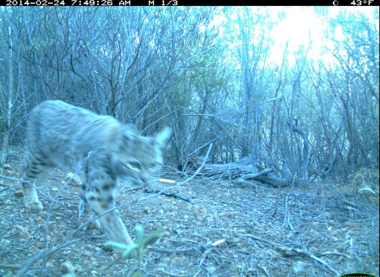
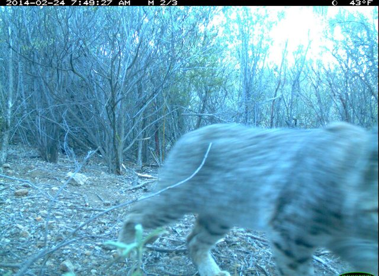
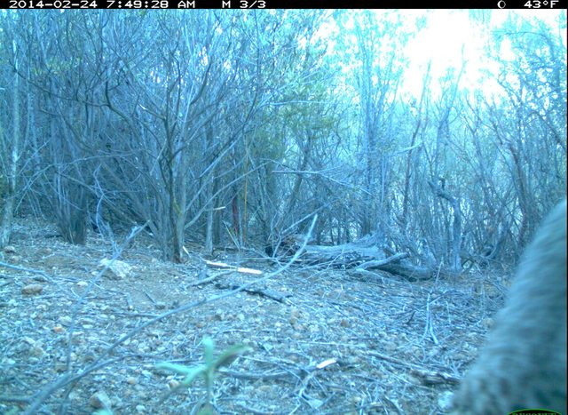

## Today

1. Probability output versus action
2. Floors and transparent baselines
3. Frames, sequences, and cameras
4. Guided Lab 1

## A probability is not an action

For one frame, a model provides $\widehat p(\text{animal present})$.

The analyst still chooses:

- threshold;
- relative error costs;
- whether uncertain cases receive human review;
- which population the rule is intended for.

We will evaluate the probability model before pretending the action is settled.

## Three reference points

1. **Observed majority-class reference:** what fraction would be correct if we
   chose the more common label in this displayed split after seeing its labels?
2. **Logistic baseline:** what do documented simple summaries explain?
3. **Provided AI system:** what does the flexible representation add?

The first quantity describes class balance; it is not a fitted, deployable rule.
A headline AI score without simple reference points has no scale.

## One file, several units {.smaller}

| Question | Relevant unit |
|---|---|
| What is scored and counted in accuracy? | frame |
| Which observations are dependent? | trigger sequence |
| What defines the protected split and new-location target? | camera location |

Today we pool accuracy over frames, so cameras are weighted by their frame
counts. The split follows the claim, not the convenience of a random-number
generator.

## Three frames are not three independent scenes {.smaller}

:::: {.columns}
::: {.column .sequence-frame width="33%"}
{fig-alt="Bobcat entering a rocky creek bed in the first frame of a camera-trap sequence"}

**Frame 1 · 7:49:26**
:::

::: {.column .sequence-frame width="33%"}
{fig-alt="Bobcat moving up the same rocky creek bed one second later"}

**Frame 2 · 7:49:27**
:::

::: {.column .sequence-frame width="33%"}
{fig-alt="Bobcat farther up the same rocky creek bed two seconds after the first frame"}

**Frame 3 · 7:49:28**
:::
::::

Same camera, same trigger sequence, nearly the same background. A random frame
split can put this shared scene on both sides of the evaluation.

::: notes
[Sources]

- Caltech Camera Traps, LILA BC: https://lila.science/datasets/caltech-camera-traps (Community Data License Agreement—Permissive).
- Frozen Week 1 release images `cct0127`–`cct0129`; official source files `598f7899-23d2-11e8-a6a3-ec086b02610b.jpg`, `5a23108e-23d2-11e8-a6a3-ec086b02610b.jpg`, and `597e6333-23d2-11e8-a6a3-ec086b02610b.jpg`; sequence `701ebda8-5567-11e8-ae8b-dca9047ef277`, category `bobcat`, location `39`.
:::

## Paired correctness keeps the cases aligned

Two email-routing systems see the same 100 messages:

| | AI correct | AI wrong |
|---|---:|---:|
| Baseline correct | 68 | 9 |
| Baseline wrong | 15 | 8 |

The four cells are mutually exclusive and sum to 100. The two accuracies are
descriptive summaries; the discordant cells, 9 and 15, show where the systems
differ on the same messages. Formal comparison waits until Week 5.

## A case gallery is diagnostic, not representative {.smaller}

A locked rule selects one reproducibly random error and one highest-confidence
error per system before any case is displayed.

- This prevents browsing until a persuasive example appears.
- The selected cases can reveal a plausible mechanism or useful contrast.
- Four purposively selected errors cannot estimate how common a pattern is.

## Worked example: an ambitious extension {.smaller}

An email-routing study locks logistic regression and obtains held-out accuracy
$0.78$. After seeing it, an AI assistant proposes a random forest, which scores
$0.84$ on the same holdout.

- The random forest result is a reproducible **exploratory extension**.
- It is not clean confirmation because model choice used the holdout.
- It cannot replace the locked primary comparison without new untouched data.
- A lower score could still reveal a useful failure mode.

## How the ambitious attempt earns credit

1. Make a substantial change, not a cosmetic rewrite.
2. Keep the official data split and primary analysis visible.
3. Preserve the prompt, code, output, and any failure.
4. State exactly what the extension does—and does not—establish.

Improvement is not part of the rubric.

## Lab checkpoints

By minute 5: the bias–variance scaffold attempted before its reveal.

By minute 15: six random frames, one full sequence, and class balance inspected.

By minute 28: baseline/AI performance and the four-cell paired table completed on held-out cameras.

By minute 42: four reproducibly selected errors displayed and interpreted.

Before leaving: AI-claim audit and four-sentence handoff saved.

## HW1 handoff {.smaller}

You may reuse:

- data loader;
- documented feature list;
- baseline fit;
- paired-table code.

You independently analyze new cameras, select errors reproducibly, and audit an AI explanation of split leakage.

The final five points require one ambitious AI-assisted baseline extension. It
remains exploratory even if its held-out score is higher.
