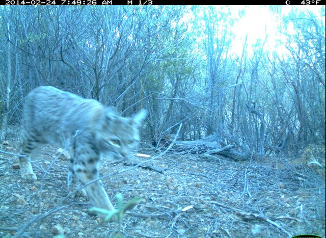
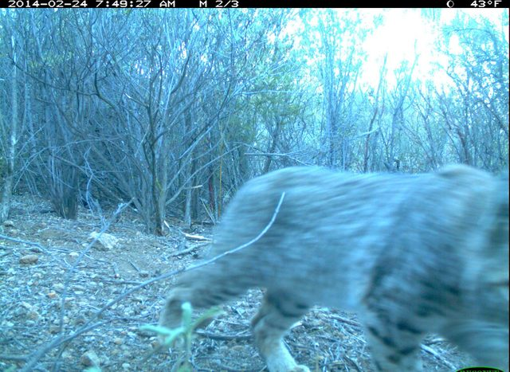
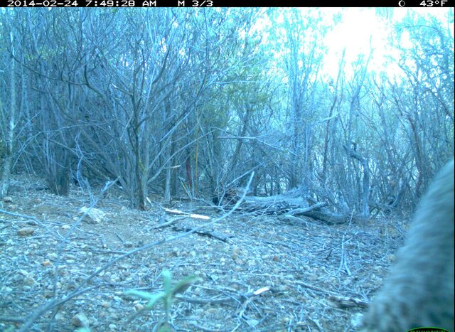

## Today {.smaller}

1. How statistics and ML fit the same model, and why they stop in different places.
2. How precise an estimate is: curvature and the delta method.
3. What exactly we compare in the lab.

Then the lab.

## Fitting means searching {.smaller}

Logistic regression and a neural network both minimize the same loss: the negative log-likelihood, which ML calls binary cross-entropy. With features, there is no formula for the answer like $\hat p = k/n$. We search for the minimum.

```{python}
#| fig-width: 9
#| fig-height: 2.8
import numpy as np
import matplotlib.pyplot as plt

k, n = 7, 10

def sigmoid(b):
    return 1 / (1 + np.exp(-b))

def loss(b):
    return -(k * np.log(sigmoid(b)) + (n - k) * np.log(1 - sigmoid(b)))

def slope(b):
    return n * sigmoid(b) - k

beta = np.linspace(-1.5, 3, 300)
b0 = -0.5
fig, ax = plt.subplots(figsize=(9, 2.8))
ax.plot(beta, loss(beta), color="#155a8a", linewidth=2.2, label="loss for 7 animal photos out of 10")
near = np.linspace(b0 - 0.6, b0 + 0.6, 50)
ax.plot(near, loss(b0) + slope(b0) * (near - b0), color="#c41230", linestyle="--", linewidth=1.8,
        label="tangent at the current guess")
ax.scatter([b0], [loss(b0)], color="#c41230", zorder=3)
ax.text(b0 + 0.08, loss(b0) + 0.35, "current guess", color="#c41230", fontsize=10)
ax.set_xlabel("intercept β₀")
ax.set_ylabel("loss")
ax.set_ylim(5.5, 11)
ax.legend(frameon=False, fontsize=9, loc="upper right")
ax.spines[["top", "right"]].set_visible(False)
plt.tight_layout()
plt.show()
```

At each guess, the **derivative** of the loss, the slope of the tangent line, says which way is downhill and how steep it is.

## Two ways to search {.smaller}

- **Gradient descent**, the ML default: take a small step downhill, sized by the slope. Repeat. $\;\beta_{\text{new}} = \beta - \eta\, L'(\beta)$
- **Newton–Raphson**, the statistics default: use the slope and the curvature to jump to the bottom of the local parabola. $\;\beta_{\text{new}} = \beta - L'(\beta)/L''(\beta)$

```{python}
#| fig-width: 9
#| fig-height: 2.7
def curvature(b):
    return n * sigmoid(b) * (1 - sigmoid(b))

newton = [0.0]
for step in range(3):
    b = newton[-1]
    newton.append(b - slope(b) / curvature(b))

descent = [0.0]
for step in range(6):
    b = descent[-1]
    descent.append(b - 0.05 * slope(b))

fig, ax = plt.subplots(figsize=(9, 2.7))
ax.plot(beta, loss(beta), color="#9aa4b2", linewidth=2)
ax.plot(descent, [loss(b) for b in descent], "o-", color="#155a8a", markersize=6,
        label="gradient descent: 6 small steps, stopped short")
ax.plot(newton, [loss(b) for b in newton], "s--", color="#c41230", markersize=6,
        label="Newton–Raphson: at the minimum in 2 steps")
ax.axvline(np.log(k / (n - k)), color="#252525", linestyle=":", linewidth=1)
ax.text(np.log(k / (n - k)) + 0.03, 6.03, "MLE = logit(0.7) = 0.85", fontsize=10)
ax.set_xlabel("intercept β₀")
ax.set_ylabel("loss")
ax.set_xlim(-0.3, 1.6)
ax.set_ylim(6.0, 7.2)
ax.legend(frameon=False, fontsize=9, loc="upper right")
ax.spines[["top", "right"]].set_visible(False)
plt.tight_layout()
plt.show()
```

::: notes
Both start at 0, the usual default. Newton is fast but can overshoot from a bad start: from β₀ = −2 on this problem it jumps past the minimum and diverges. Software adds safeguards such as step halving. Gradient descent is slow but cheap per step, which matters when there are millions of weights.
:::

## Converged, or close enough? {.smaller}

| | Statistics | Machine learning |
|---|---|---|
| Typical method | Newton–Raphson (what `glm` and `statsmodels` use) | gradient descent on random batches of data |
| Stops when | the estimate stops changing | held-out error stops improving, or time runs out |
| Ends at | the MLE | close to a minimum, not exactly the MLE |
| Standard errors | from the curvature at the MLE | not routinely computed |

Statistics goes all the way to the optimum, because the theory behind standard errors and tests lives there. ML stops when it is close enough. With millions of weights the exact minimum is out of reach, and stopping early keeps a network from fitting noise.

## Curvature gives the standard error {.smaller}

A sharply curved log-likelihood pins the estimate down. A flat one does not.

```{python}
#| fig-width: 9
#| fig-height: 2.3
p_grid = np.linspace(0.4, 0.95, 300)
fig, ax = plt.subplots(figsize=(9, 2.3))
for count, total, color in [(7, 10, "#9aa4b2"), (70, 100, "#155a8a")]:
    loglik = count * np.log(p_grid) + (total - count) * np.log(1 - p_grid)
    best = count * np.log(0.7) + (total - count) * np.log(0.3)
    ax.plot(p_grid, loglik - best, color=color, linewidth=2.2, label=f"{count} of {total}")
ax.axvline(0.7, color="#252525", linestyle=":", linewidth=1)
ax.set_xlabel("p")
ax.set_ylabel("log-likelihood\n(0 at the peak)")
ax.set_ylim(-6, 0.5)
ax.legend(frameon=False, fontsize=9, loc="lower left")
ax.spines[["top", "right"]].set_visible(False)
plt.tight_layout()
plt.show()
```

$$\operatorname{SE}(\hat\theta) \approx \frac{1}{\sqrt{-\ell''(\hat\theta)}}.$$

**Check with $p$.** At $\hat p = k/n$, $-\ell''(\hat p) = n/\{\hat p(1-\hat p)\}$, so $\operatorname{SE}(\hat p) = \sqrt{\hat p(1-\hat p)/n}$: the formula you already know. This is where the standard errors in `summary()` come from.

## How precise is a function of $\hat p$? {.smaller}

Curvature gave us the precision of $\hat p$:

$$\operatorname{SE}(\hat p) = \sqrt{\frac{\hat p(1-\hat p)}{n}}.$$

But we often report a **function** of $\hat p$, such as Tuesday's odds $\hat p/(1-\hat p)$, or the log-odds $\operatorname{logit}(\hat p)$, which is the logistic regression intercept $\hat\beta_0$.

How precise are those?

## The idea: zoom in until the curve is a line {.smaller}

```{python}
#| fig-width: 9
#| fig-height: 3.0
p_grid = np.linspace(0.5, 0.82, 200)
odds = p_grid / (1 - p_grid)
p0, se_p = 0.7, np.sqrt(0.7 * 0.3 / 100)
g0, deriv = p0 / (1 - p0), 1 / (1 - p0) ** 2

fig, ax = plt.subplots(figsize=(9, 3.0))
ax.plot(p_grid, odds, color="#155a8a", linewidth=2.2, label="odds  g(p) = p/(1 − p)")
ax.plot(p_grid, g0 + deriv * (p_grid - p0), color="#c41230", linestyle="--", linewidth=1.5,
        label=f"tangent line at p̂ = 0.7 (derivative {deriv:.1f})")
ax.axvspan(p0 - se_p, p0 + se_p, color="#155a8a", alpha=0.12)
ax.axhspan(g0 - deriv * se_p, g0 + deriv * se_p, color="#c41230", alpha=0.10)
ax.text(p0 + se_p + 0.004, 0.6, "where p̂ typically lands (±1 SE)", color="#155a8a", fontsize=10)
ax.text(0.505, g0 + deriv * se_p + 0.08, "where the estimated odds land", color="#c41230", fontsize=10)
ax.set_xlabel("p̂")
ax.set_ylabel("estimated odds")
ax.set_ylim(0, 4.6)
ax.legend(frameon=False, fontsize=9, loc="upper left")
ax.spines[["top", "right"]].set_visible(False)
plt.tight_layout()
plt.show()
```

The same tangent-line idea we used to fit. Near $\hat p$, the curve is almost its tangent line, and the tangent stretches the spread of $\hat p$ by the derivative $g'(\hat p)$:

$$\operatorname{SE}\{g(\hat p)\} \approx |g'(\hat p)|\;\operatorname{SE}(\hat p).$$

This is the **delta method**.

<p class="compact-note">The formal version expands around the true p: g(p̂) ≈ g(p) + g′(p)(p̂ − p), so Var{g(p̂)} ≈ g′(p)² p(1 − p)/n. In practice we plug in p̂.</p>

## Worked example: the odds {.smaller}

With 70 animal photos out of 100, $\hat p = 0.7$ and
$$\operatorname{SE}(\hat p) = \sqrt{\frac{0.7 \times 0.3}{100}} = 0.046.$$

1. **Estimate.** The odds are $0.7/0.3 = 2.33$, about 7 animal photos for every 3 empty ones.
2. **Derivative.** For $g(p) = p/(1-p)$, $g'(p) = 1/(1-p)^2$. The tangent to the curve at $\hat p = 0.7$ has $g'(0.7) = 1/0.3^2 = 11.1$.
3. **Standard error.** Multiply the derivative by $\operatorname{SE}(\hat p)$: $11.1 \times 0.046 = 0.51$.

In HW1 you do the same for the intercept $\hat\beta_0 = \operatorname{logit}(\hat p)$.

<p class="compact-note">Standard errors return in force in Week 4, when we ask how precise a benchmark score is.</p>

## Remember Tuesday's bobcat? {.smaller}

:::: {.columns}
::: {.column .sequence-frame width="33%"}
{fig-alt="Bobcat entering a rocky creek bed in the first frame of a camera-trap burst"}

**Photo 1 · 7:49:26**
:::

::: {.column .sequence-frame width="33%"}
{fig-alt="Bobcat moving up the same rocky creek bed one second later"}

**Photo 2 · 7:49:27**
:::

::: {.column .sequence-frame width="33%"}
{fig-alt="Bobcat farther up the same rocky creek bed two seconds after the first photo"}

**Photo 3 · 7:49:28**
:::
::::

The camera took three photos in three seconds. They are nearly the same picture.

| Question | Unit |
|---|---|
| What does accuracy count? | a photo |
| Which photos are not independent? | the three in a burst |
| What do we hold out to test on? | whole cameras |

::: notes
Sources: Caltech Camera Traps, LILA BC (Community Data License Agreement, Permissive). Course images cct0127 to cct0129; sequence 701ebda8-5567-11e8-ae8b-dca9047ef277, category bobcat, location 39.

If photos were split at random, two photos of this bobcat could land in training and the third in testing. The model would be tested on a scene it has already seen, which makes it look better than it will at a new camera. The lab shows this.
:::

## Three reference points {.smaller}

An AI accuracy of 90% means little until you know what simpler approaches get. In the lab we compare three things on the same photos:

1. **Always guess the more common label.** If half the photos are empty, always saying "empty" is right half the time.
2. **A simple model.** Logistic regression on brightness, color, and edges.
3. **The AI.** MegaDetector's probabilities, turned into calls with a cutoff.

## Compare on the same photos {.smaller}

Two models sort the same 100 photos:

| | AI right | AI wrong |
|---|---:|---:|
| **Simple model right** | 68 | 9 |
| **Simple model wrong** | 15 | 8 |

The simple model is right on 77 and the AI on 83. The interesting photos are the ones where they disagree: 9 that only the simple model got right and 15 that only the AI got right. Whether 15 versus 9 is a real difference waits until Week 5.

## Which mistakes should we look at? {.smaller}

Looking at errors is how you learn what a model gets wrong. But if you browse until something looks interesting, you will find a story every time.

- Pick the errors by a rule set in advance: one random error and the most confident error for each model.
- What you see can suggest *why* a model fails.
- Four hand-picked errors cannot tell you how *common* that failure is.

## An extra model, after the fact {.smaller}

In HW1 you try one bigger change with AI help, such as a nonlinear model or a new feature. Suppose the simple model gets 0.78 on the held-out cameras. After seeing that, an AI suggests a random forest, which gets 0.84 on the same cameras.

- It is worth reporting, as exploration.
- It is not a fair win, because you chose it after seeing the held-out data.
- Confirming it would take new photos that neither model has seen.

You earn the points for a real attempt, shown honestly, whether or not it does better.

## Today's lab {.smaller}

1. Name the four pieces for the wildlife team.
2. Look at random photos and one full burst.
3. Fit the simple model and compare it with the AI on new cameras.
4. See what changes if photos are split at random.
5. Choose mistakes by a rule, then look at them.
6. Check an AI's explanation against the evidence.
7. Write the handoff to the team.

## HW1 handoff {.smaller}

From the lab you can reuse the data loader, the photo features, the logistic regression fit, and the paired-table code.

On your own, you analyze the homework cameras, pick errors by the rule, and check an AI's explanation of why a random split can make a model look better than it is.
