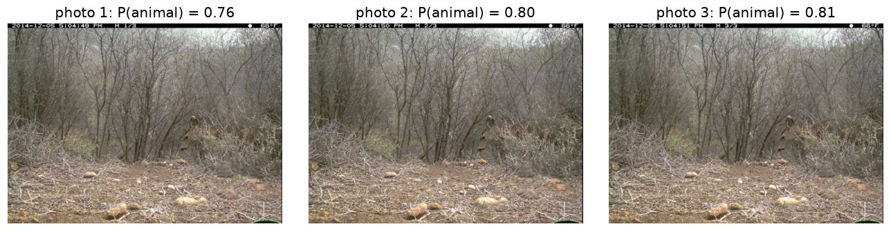

## Recap {.smaller}

- Many benchmark scores are an accuracy, which is an estimated proportion.
- Wald breaks near 0 and 1. Wilson and Clopper–Pearson behave better.
- Every one of them assumes the items in the benchmark, each photo or each test question, are **independent**.

**Today:** what happens when they are not.

## Benchmark items often come in clusters {.smaller .compact-table}

| Benchmark | One scored item | Cluster |
|---|---|---|
| Camera traps | one photo | the burst of three photos, and the camera |
| Reading comprehension (for example, [SQuAD](https://rajpurkar.github.io/SQuAD-explorer/)) | one question | the passage it asks about |
| Instruction following (project track) | one instruction check | the prompt |
| Human preferences (project track) | one judgment | the response pair, and the Reddit post |

Items in the same cluster tend to be easy or hard together. A hard passage makes all its questions harder, and a hidden animal is hidden in all three photos.

{width="88%" fig-align="center"}

## Two levels of randomness {.smaller}

A reading benchmark has $G$ passages with $m$ questions each. A grader scores each answer from 0 to 100; call the score $Y$.

1. **Which passage?** Passage $g$ has its own mean score $\mu_g$, because some passages are harder than others. Across passages, $\mu_g$ has mean $\mu$ and variance $\tau^2$.
2. **Which answers?** Given $\mu_g$, the scores for the questions about passage $g$ are independent, $Y \mid \mu_g \sim N(\mu_g, \sigma^2)$.

What is the average score of a randomly chosen question?

::: {.fragment}
Average within a passage first, then across passages:
$$E[Y] = E\bigl[E[Y \mid \mu_g]\bigr] = E[\mu_g] = \mu.$$
This is the **law of iterated expectations**.
:::

## How much does one score vary? {.smaller}

A score varies because answers vary within a passage, and because passages differ.

::: {.fragment}
The **law of total variance** adds the two parts:
$$\operatorname{Var}(Y) = \underbrace{E\bigl[\operatorname{Var}(Y \mid \mu_g)\bigr]}_{\text{within a passage: } \sigma^2} + \underbrace{\operatorname{Var}\bigl(E[Y \mid \mu_g]\bigr)}_{\text{between passages: } \tau^2} = \sigma^2 + \tau^2.$$
:::

::: {.fragment}
If $\sigma = 16$ and $\tau = 8$, then $\operatorname{Var}(Y) = 256 + 64 = 320$. One fifth of the variance comes from which passage the question is about.
:::

## Are two questions about one passage independent? {.smaller}

Given the passage, yes. But the passage itself is random.

::: {.fragment}
Split the covariance the same way, with the **law of total covariance** from Week 2:

$$\operatorname{Cov}(Y_1, Y_2) = \underbrace{E\bigl[\operatorname{Cov}(Y_1, Y_2 \mid \mu_g)\bigr]}_{\text{within a passage: } 0} + \underbrace{\operatorname{Cov}(\mu_g,\, \mu_g)}_{\tau^2} = \tau^2.$$

Both scores rise and fall with the passage's difficulty. Their correlation is the share of the variance that comes from the passage,
$$\rho = \frac{\tau^2}{\sigma^2 + \tau^2} = \frac{64}{320} = 0.2.$$
:::

## Two questions, one passage {.smaller}

For the total of $m = 2$ scores from one passage:

$$\operatorname{Var}(Y_1 + Y_2) = \operatorname{Var}(Y_1) + \operatorname{Var}(Y_2) + 2\operatorname{Cov}(Y_1, Y_2) = 2(\sigma^2 + \tau^2) + 2\tau^2.$$

The $2\tau^2$ is extra variance that an independence assumption ignores. With $\sigma = 16$ and $\tau = 8$, that is $640 + 128 = 768$ instead of 640, or 20% more.

## The design effect {.smaller}

With $m$ items per cluster and $n$ items in all, the mean score $\bar Y$ has

$$\operatorname{Var}(\bar Y) = \frac{\sigma^2 + \tau^2}{n}\,\bigl[1 + (m-1)\rho\bigr].$$

- **Design effect:** $1 + (m-1)\rho$.
- **Effective sample size:** $n$ divided by the design effect.

Worked example: 100 passages with 4 questions each and $\rho = 0.2$. The design effect is $1 + 3(0.2) = 1.6$, so 400 questions carry about as much information as **250** independent ones. An interval that ignores this and claims 95% actually covers about **88%** of the time.

<p class="compact-note">The same design effect applies to an accuracy. In HW4 you derive it for camera-trap photos.</p>

## What $\rho$ does to 400 questions {.smaller}

```{python}
#| fig-width: 10
#| fig-height: 3.6
import numpy as np
import matplotlib.pyplot as plt
from scipy.stats import norm

n, m = 400, 4
rho = np.linspace(0, 1, 200)
design_effect = 1 + (m - 1) * rho
effective_n = n / design_effect
naive_coverage = 2 * norm.cdf(1.96 / np.sqrt(design_effect)) - 1

fig, (left, right) = plt.subplots(1, 2, figsize=(10, 3.6))

left.plot(rho, effective_n, color="#155a8a", linewidth=2.2)
left.axhline(100, color="#9aa4b2", linestyle="--", linewidth=1)
left.text(0.02, 75, "floor: 100 passages, one per passage", ha="left", color="#5a6472", fontsize=10)
left.scatter([0, 0.2, 1], [400, 250, 100], color="#c41230", zorder=3)
left.annotate("our example: 250", (0.2, 250), xytext=(0.32, 300), fontsize=10,
              arrowprops=dict(arrowstyle="->", color="#c41230"))
left.set_xlabel("within-passage correlation ρ")
left.set_ylabel("effective sample size")
left.set_ylim(0, 420)
left.set_title("How many independent questions\nthe 400 are worth", fontsize=11)

right.plot(rho, naive_coverage, color="#155a8a", linewidth=2.2)
right.axhline(0.95, color="#252525", linestyle="--", linewidth=1)
right.text(0.98, 0.955, "claimed 95%", ha="right", fontsize=10)
right.scatter([0.2], [2 * norm.cdf(1.96 / np.sqrt(1.6)) - 1], color="#c41230", zorder=3)
right.annotate("our example: 88%", (0.2, 0.879), xytext=(0.32, 0.84), fontsize=10,
               arrowprops=dict(arrowstyle="->", color="#c41230"))
right.set_xlabel("within-passage correlation ρ")
right.set_ylabel("actual coverage")
right.set_ylim(0.6, 1.0)
right.set_title("Coverage of an interval that\nignores the passages", fontsize=11)

for ax in (left, right):
    ax.spines[["top", "right"]].set_visible(False)
plt.tight_layout()
plt.show()
```

At $\rho = 0$ the 400 questions are independent. At $\rho = 1$ every question about a passage gets the same score, so the benchmark holds only 100 pieces of information, one per passage. With more questions per passage, the same $\rho$ costs even more. With $m = 20$ and $\rho = 0.1$, the design effect is 2.9.

## Fixing the coverage {.smaller}

The interval on the last slide misses because its standard error pretends the 400 questions are independent. The bootstrap estimates the sampling distribution by **resampling the data the same way they were sampled**. The benchmark sampled passages, and each passage brought its questions with it.

```{python}
#| fig-width: 9
#| fig-height: 2.9
rng = np.random.default_rng(2027)
G, m, mu, sigma, tau = 100, 4, 72, 16, 8

def draw_benchmark():
    """Draw one benchmark: passage means first, then the scores within each passage."""
    passage_means = rng.normal(mu, tau, G)
    scores = rng.normal(np.repeat(passage_means, m), sigma)
    return scores.reshape(G, m)

true_means = np.array([draw_benchmark().mean() for _ in range(4000)])
observed = draw_benchmark()
all_scores = observed.ravel()
passage_boot = np.array([observed[rng.integers(0, G, G)].mean() for _ in range(2000)])
question_boot = np.array([all_scores[rng.integers(0, G * m, G * m)].mean() for _ in range(2000)])

bins = np.linspace(-4.5, 4.5, 46)
fig, ax = plt.subplots(figsize=(9, 2.9))
ax.hist(true_means - true_means.mean(), bins=bins, density=True, histtype="stepfilled",
        color="#d9d9d9", label=f"true sampling distribution (SD {true_means.std():.2f})")
ax.hist(passage_boot - passage_boot.mean(), bins=bins, density=True, histtype="step",
        linewidth=2.2, color="#155a8a", label=f"resample passages (SD {passage_boot.std():.2f})")
ax.hist(question_boot - question_boot.mean(), bins=bins, density=True, histtype="step",
        linewidth=2.2, color="#c41230", label=f"resample questions (SD {question_boot.std():.2f})")
ax.set_xlabel("mean score minus its center")
ax.set_yticks([])
ax.legend(frameon=False, fontsize=9, loc="upper right")
ax.spines[["top", "right", "left"]].set_visible(False)
plt.tight_layout()
plt.show()
```

Resampling whole passages reproduces the spread of the true sampling distribution. Resampling single questions is too narrow, the same mistake as the naive interval.

## The cluster bootstrap, step by step {.smaller}

1. Draw $G$ clusters, with replacement, from the $G$ clusters you have.
2. Keep every item in each drawn cluster.
3. Recompute the mean score.
4. Repeat 2,000 times. The middle 95% of those means is the interval.

Resampling whole clusters keeps the "easy or hard together" pattern in every bootstrap sample.

**Estimating the design effect from data:** divide the bootstrap variance by $s^2/n$, the variance if the questions were independent ($s^2$ is the sample variance of the scores). For example, if the bootstrap variance is 1.28 and $s^2/n = 320/400 = 0.80$, the design effect is 1.6. With $m = 4$, solving $1 + 3\rho = 1.6$ gives $\hat\rho = 0.2$.

## Writing the result {.smaller}

> On [population], the estimated [quantity] was [estimate] ([interval type] 95% CI [limits]). [The main limitation, in plain words.]

For the reading benchmark:

> On questions about these 100 passages, the estimated mean score was 72 (passage-bootstrap 95% CI 70 to 74). All 100 passages come from one encyclopedia.

For the wildlife team, every interval describes photos from **these cameras**. A new camera is outside that population.

## How many photos should the team label? {.smaller}

The team wants its 95% interval for accuracy, which is near 0.9, to reach no more than 3 points on either side:
$$z\sqrt{\frac{p(1-p)}{n}} \le 0.03.$$

With independent photos, solving for $n$ gives
$$n \ge \frac{z^2\,p(1-p)}{0.03^2} = \frac{3.84 \times 0.09}{0.0009} \approx 385.$$

With bursts of three photos and $\rho = 0.4$, the design effect is $1 + 2(0.4) = 1.8$. Each photo is worth only $1/1.8$ of an independent one, so the team needs 1.8 times as many, about **690 photos, or 230 sequences**.

## Does your project have clusters? {.smaller .compact-table}

| Track | One scored item | Clusters? |
|---|---|---|
| Food tagging | one image | No. Nothing links images, so treat them as independent. |
| Pet tagging | one image | No, same as Food. |
| Human preferences | one judge verdict | Yes, if you judge each pair in both orders, since the two verdicts share a pair. A few pairs also come from the same Reddit post. |
| Instruction following | one instruction check | Yes. Each response gets several checks, and each prompt has several responses. |

For Food and Pets, today's other lessons matter more. Per-class and per-breed counts are small, so those intervals are wide, and cat-or-dog accuracy is near 1, where Wald fails.

Before computing an interval, ask what was sampled. If items share a source, resample the source.

## Today's lab {.smaller}

1. Look at the photos, and see how a burst is three near-copies.
2. Compare Wald, Wilson, and Clopper–Pearson.
3. Check by simulation whether each interval keeps its promise.
4. A camera with no mistakes.
5. Look at the mistakes: is the model wrong, or the label?
6. The sequence bootstrap and the design effect.
7. Night photos: how much do we actually know?

You will end with the result you would report to the wildlife team.

## HW4 handoff {.smaller}

- **Problem 1:** derive the Wilson interval, the zero-error bound, and the design effect.
- **Problem 2:** apply them to the homework cameras, and decide which interval to report.
- **Problem 3:** use AI to review and test a bootstrap function, and find what is wrong.

Do Problem 1 first. Problems 2 and 3 use its results.

## What we did today {.smaller}

1. Benchmark items often come in clusters, and items in a cluster tend to be right or wrong together.
2. The law of total covariance turns that into a within-cluster correlation $\rho$.
3. The design effect $1 + (m-1)\rho$ tells us how much an independence assumption understates the variance.
4. The cluster bootstrap resamples whole clusters.
5. No interval can reach beyond the population it sampled.
